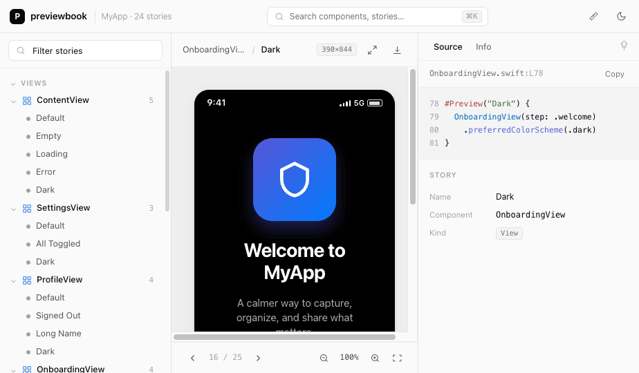

# previewbook

[](https://www.npmjs.com/package/@henteko/previewbook)
[](https://nodejs.org)
[](LICENSE)

SwiftUI の `#Preview` を撮影し、ナビゲーション・検索・ソース表示を備えた Storybook ライクなウェブサイトとして閲覧する CLI ツールです。



## 必要環境

- Node.js 20 以上
- macOS + **Xcode（MCP ブリッジ `xcrun mcpbridge` を同梱するバージョン）**
- 対象プロジェクトを Xcode で開いておくこと

`mcpbridge` を含まない古い Xcode では起動時に `MCP bridge exited unexpectedly (code=72)` /
`xcrun: error: unable to find utility "mcpbridge"` になります。Xcode を更新すると解消します
（動作確認は Xcode 26.0.1）。フル Xcode が選択されていることも確認してください。

```bash
xcode-select -p            # /Applications/Xcode.app/... を指していること
xcrun --find mcpbridge     # パスが表示されれば OK
# 違う場合: sudo xcode-select -s /Applications/Xcode.app
```

## 使い方

```bash
# グローバルにインストール
npm install -g @henteko/previewbook

# 単発で実行
npx @henteko/previewbook
```

対象プロジェクトを Xcode で開いた状態で実行します。CLI は基本 2 コマンドです。

```bash
previewbook                  # 撮影してローカルサーバーを起動し、ブラウザで開く
previewbook build -o ./out   # 撮影して静的ファイル一式を ./out に書き出す
```

### オプション

| オプション | 説明 |
|---|---|
| `-o, --output <path>` | 出力先（`build` で必須） |
| `--project <hint>` | Xcode ウィンドウが複数開いているときの絞り込み |
| `--title <text>` | サイトタイトルの上書き |
| `--port <number>` | サーブ時のポート（既定: ランダム） |
| `--no-open` | ブラウザを自動で開かない（サーブ時） |
| `--timeout <sec>` | `RenderPreview` の 1 枚あたりタイムアウト |
| `-v, --verbose` | 詳細ログ（MCP の生のやり取りも表示） |

### UI をすぐ見る（デモ）

Xcode / MCP なしで UI を確認できます（サンプルデータとダミー PNG から静的サイトを生成）。

```bash
git clone https://github.com/henteko/previewbook.git
cd previewbook && npm install
npm run demo && open examples/demo-site/index.html
```

## 注意事項

- **静的レンダリング**：MCP は撮影のみのため、Storybook の Controls（args を動かして即反映）は非対応です。
  ライト/ダークやデバイス違いなどのバリエーションは、開発者が書いた `#Preview` をそのまま 1 Story として並べます。
- **撮影は逐次**：プレビュー数だけ `RenderPreview` を順番に実行するため、数が多いと時間がかかります。
- **複数ウィンドウ**：Xcode で複数プロジェクトを開いている場合は `--project <名前/パスの一部>` で対象を指定します。
- **接続できないとき**：`--verbose` を付けると MCP の生のやり取り（`tools/call ... <- ...`）が見えます。
  ブリッジの起動コマンドは環境変数 `PREVIEWBOOK_BRIDGE_CMD` / `PREVIEWBOOK_BRIDGE_ARGS` で差し替えできます（既定 `xcrun mcpbridge`）。

## アーキテクチャ

Xcode の MCP サーバーに JSON-RPC 2.0 over stdio で接続し、撮影 → マニフェスト生成 → サイト生成の 3 段で動きます。

```
ProjectDiscovery で対象プロジェクト + tabIdentifier を確定
  → SnapshotService がプレビューを探索（XcodeGrep）／本文取得（XcodeRead）
  → 各プレビューを RenderPreview で撮影
  → PreviewMetadataParser で名前・型・ソース断片・行範囲を付与
  → buildCatalog で stories.json のツリーに集約
  → emitManifest: stories.json + assets/*.png を出力
  → generateSite: index.html（CSS/JS インライン）を生成
  → [既定] PreviewServer でサーブ / [build] 出力先へ書き出し
```

サイトは `stories.json` を読み込んで描画する SPA です（サーブ時は `fetch`、`build` 時は HTML に JS 変数として埋め込み）。
UI の見た目は [`src/site/assets/styles.css`](src/site/assets/styles.css)、挙動は [`src/site/assets/app.js`](src/site/assets/app.js)
にあり、データ契約（`stories.json`）に触れずに差し替えられます。生成時にこの 2 ファイルは `index.html` へインライン化されます（外部依存ゼロ）。

`stories.json` のスキーマ例:

```jsonc
{
  "title": "MyApp Preview Book",
  "generatedAt": "2026-05-25T12:00:00Z",
  "tree": [
    {
      "type": "group", "name": "Views",
      "children": [{
        "type": "component", "name": "ContentView",
        "sourceFile": "MyApp/Views/ContentView.swift",
        "stories": [
          {
            "id": "contentview-default",
            "name": "Default",
            "asset": "assets/contentview_0.png",
            "source": "#Preview(\"Default\") { ContentView() }",
            "file": "MyApp/Views/ContentView.swift",
            "index": 0,
            "targetType": "ContentView",
            "kind": "macro",
            "line": 42,
            "endLine": 44
          }
        ]
      }]
    }
  ]
}
```

設計の詳細は [`docs/previewbook-design.md`](docs/previewbook-design.md) を参照してください。

## ライセンス

[Apache License 2.0](LICENSE) © henteko
